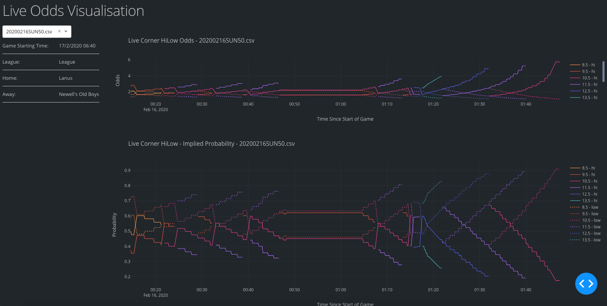
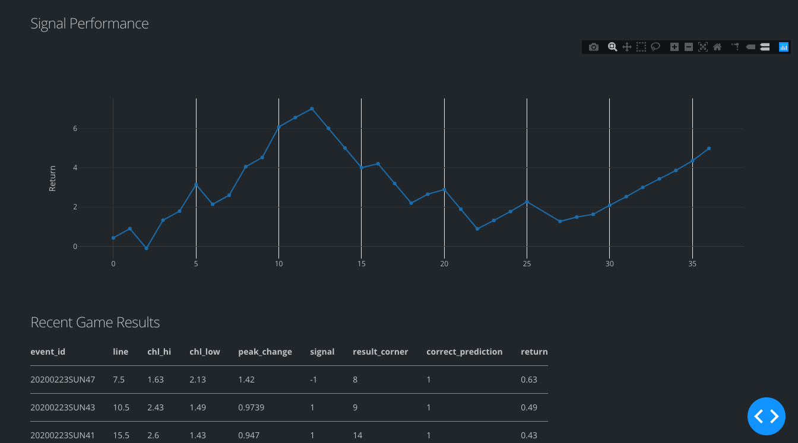

# odds-crawl-app
## Introduction

 Crawling football odds with live data visualisation






## Data Collection

All data collection scripts are contained in the folder `development`.

### Data Crawling Procedures

#### Step 1 

Run `run_schedule_crawler` shell script which runs `schedule_crawler.py`

- Change the shell script to your own directory

- Specify the working directory under `self.path_dir` before running the shell script
- This script crawls the schedule of upcoming matches (excluding matches that has already started), and export several attributes (event_id, home, away, league, start time, url) to `data/schedule.csv`
- Also create `crontab_command.txt` which includes *crontab commands* that will be used to schedule runtime of `crawler.py` 

#### Step 2

Copy the crontab commands to crontab in your computer to schedule job. More information about crontab commands is given in the appendix below.

#### Step 3

Your computer should evoke `crawler.py` according to the cronjobs.

- Specify the directory to store data. The directory should be under the `data/` folder of the main working directory that stores the script.
- For each time the script runs, a log will be written on `data/job_history.csv`
- Match data will be appended to `data/match_data.csv`
- The script will create the odds in `data/` with `event_id` as filename. **Do not open the csv file in Excel when the script is running** as Excel may automatically convert datetime strings to other formats (crazy Excel). 
- The script runs whenever the odds are still available. Script terminates when the match ends and no more odds are available for crawling.
- Crawler currently crawls live score and corner hilow odds every 10 seconds. 


### Post-crawling

The result collection file is under the folder `result_collection`.

Run the `run_update_to_result_collection` shell script, which updates match data (according to `match_data.csv` ) to `match_corner_result.csv`. Manual input of the final result of the game is needed. It is recommended to Google search for the team names and input the total corner shown in the search result.

#### Remarks

This process is to be done every few days as the result input is currently manual.

### Future development

- Will store data in a mySQL database instead of local file `schedule.csv`, `match_data.csv`, `job_history.csv` and odds files. 

## Signal

Current implementation of odd decision signal is modelled in `signal.py` along with `signal_analysis.ipynb`. There are also other Jupyter notebooks with obsolete analysis.

Signal is implemented during the crawling process. The existence of signal is checked in `crawler.py` every intervals (specified in `crawler.py`). 

### Live signal notification

The deployment of live signals is done by utilizing Telegram bot, where notification will be sent to user when there is a live signal available. It is also used to notify user through Telegram about the crawling process during the data collection period. The related codes are stored in `telegram_notification.py`

## Web App Data Visualization

### Offline live graph

An off-line live graph of odds visualisation is made with *Dash* in Python.

See `app.py` and assets folder under `data_collection`.

- Run `run_live_app` shell script to call `app.py`.

- Live games will update in live. Graphs of previous games are also available.

- Performance graph indicates the running return of the current signal implementation (specified in `signal.py`.

### Deployment

> **Under construction**

## Appendix

#### Brief note about crontab

Watch:

https://www.youtube.com/watch?v=QZJ1drMQz1A

##### Check Python version

- Can be done by typing `which python` in Terminal

1. Type `crontab -e` in terminal to enter vim edit cron jobs
2. Press `I` to go to insert mode in Vim
3. Specify the time for job, then insert Python path got from `which python`, then insert crawler.py path
4. Press `Esc` after finishing input
5. Type `:wq` to save and quit

##### Time Format

```
# ┌───────────── minute (0 - 59)
# │ ┌───────────── hour (0 - 23)
# │ │ ┌───────────── day of month (1 - 31)
# │ │ │ ┌───────────── month (1 - 12)
# │ │ │ │ ┌───────────── day of week (0 - 6) (Sunday to Saturday;
# │ │ │ │ │                                       7 is also Sunday on some systems)
# │ │ │ │ │
# │ │ │ │ │
# * * * * *  command_to_execute
```

##### Cron job utilities

`crontab -l` shows a list of cronjobs
`crontab -r` removes cronjobs

